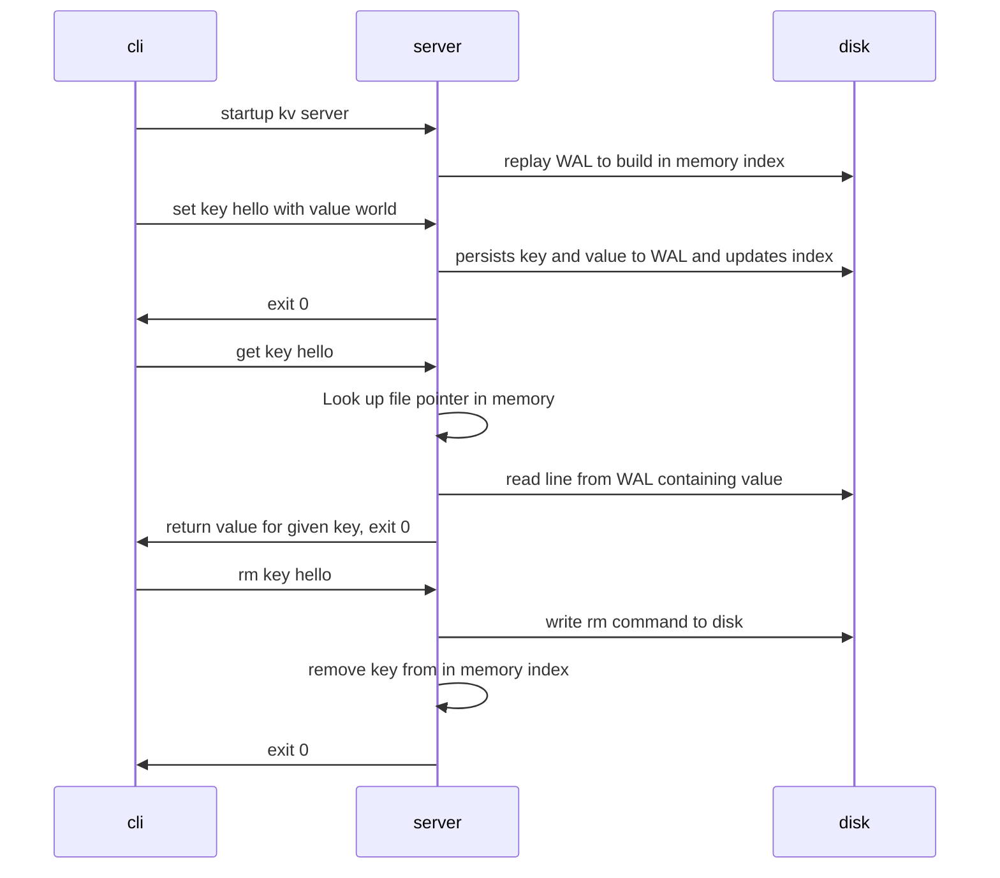

# spark-kv
A simple persistent key value store, with an in memory index, implemented in Rust.

### Goals of this project
The goal of this project is to improve my [system programing](https://en.wikipedia.org/wiki/Systems_programming) knowledge through building a networked key-value database, with multithreading and asynchronous I/O[^1]. 

[^1]: Most of the learnings for this were derived from [pingcap/talent-plan](https://github.com/pingcap/talent-plan) it's a seriously good resource so check it out!
[^2]: A lot of the designs of this project comes from the [Bitcask paper](https://riak.com/assets/bitcask-intro.pdf)

### high level sequence 

